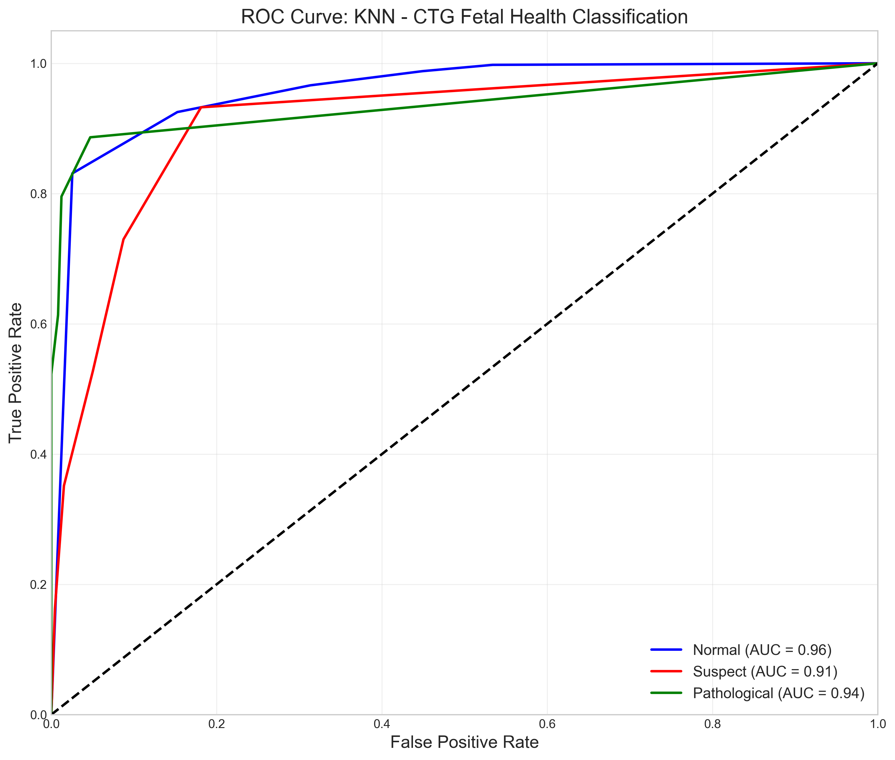
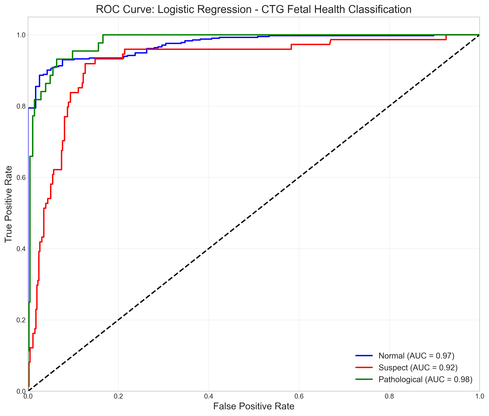
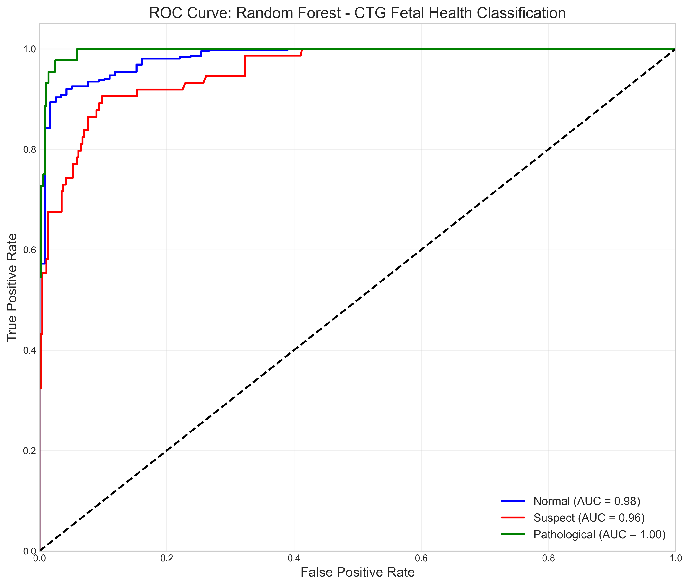
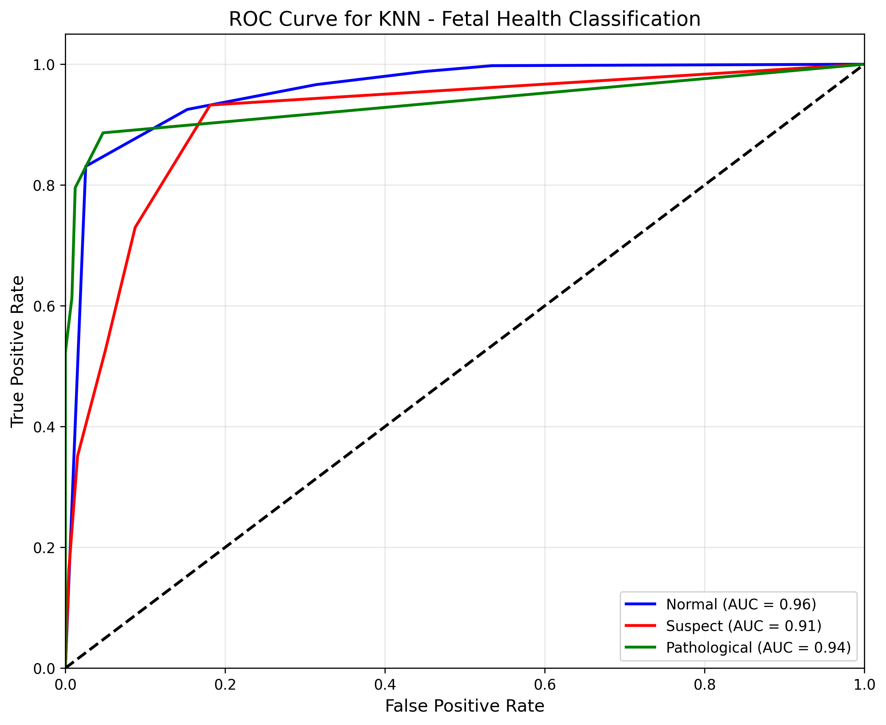
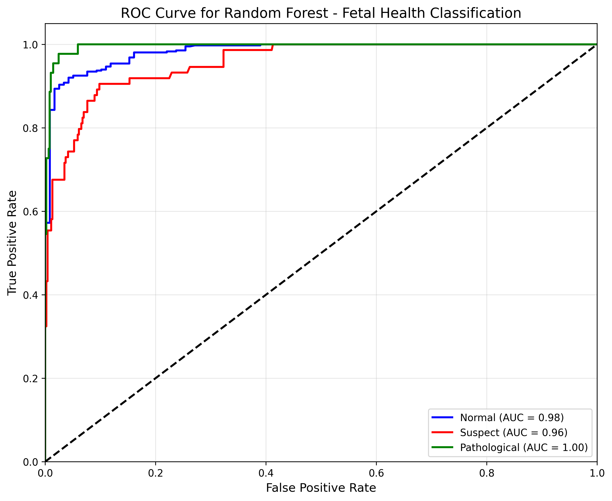
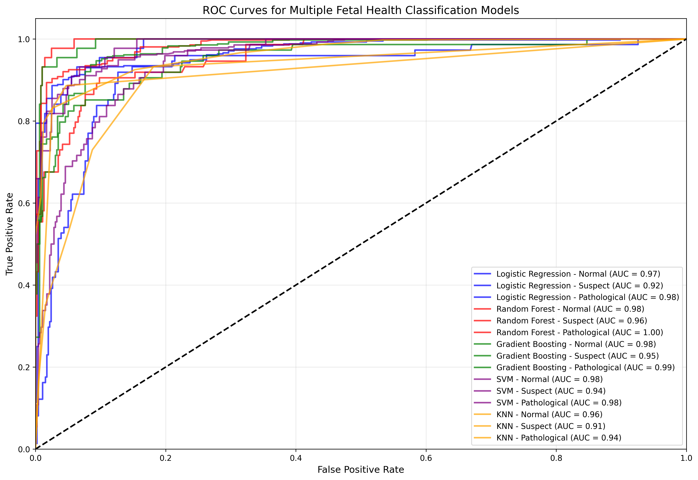

# 🍼 Early Detection of Fetal Distress Using Machine Learning  

---

## 📌 Introduction  
Fetal health monitoring is crucial to detect pregnancy complications early.  
This project uses **Cardiotocography (CTG) data** and **Machine Learning** to classify fetal health as:  
- **Normal**  
- **Suspect**  
- **Pathological**  

A **Flask web application** provides real-time predictions with a user-friendly interface.  

---

## ⚡ Features  
- CTG dataset with 21 features  
- ML models: Random Forest, Logistic Regression, KNN, SVM, Gradient Boosting  
- Best Model: **Random Forest (95% Accuracy, ROC-AUC 0.97)**  
- Flask-based web app  
- Demo input support (Normal / Suspect / Pathological)  
- Probability visualization with progress bars  

---

## 🚀 Run Locally  

Clone the project  

```bash
git clone https://github.com/YOUR-USERNAME/fetal-health-prediction.git
cd fetal-health-prediction
Create a virtual environment

bash
Copy code
python -m venv venv
source venv/bin/activate   # Linux/Mac
venv\Scripts\activate      # Windows
Install dependencies

bash
Copy code
pip install -r requirements.txt
Run the app

bash
Copy code
python app.py
Visit http://127.0.0.1:5000/

🖥️ Usage / Examples
Web Interface
Input CTG parameters manually

Or load demo data (Normal, Suspect, Pathological)

View prediction + probabilities instantly

json
Copy code
{
  "result": "Pathological",
  "probabilities": {
    "Normal": "5.2%",
    "Suspect": "10.7%",
    "Pathological": "84.1%"
  }
}
## 📊 Screenshots

### Homepage


### Prediction Page


### Confusion Matrix


### ROC Curves

#### KNN Model


#### Logistic Regression


#### Random Forest


#### Alternative KNN Visualization


#### Alternative Random Forest Visualization


#### Multiple Models Comparison



⚙️ Tech Stack
Frontend: HTML, CSS, Bootstrap
Backend: Flask
ML Models: scikit-learn (Random Forest, Logistic Regression, KNN, SVM, Gradient Boosting)
Deployment: Localhost / Future: AWS, Azure, Heroku

🔑 Environment Variables
To run this project, you may need to set the following environment variables:

FLASK_APP = app.py
FLASK_ENV = development

🧪 Running Tests
bash
Copy code
pytest tests/
(Add test scripts in a tests/ folder.)

📈 Optimizations
Applied GridSearchCV for hyperparameter tuning

Balanced classes with class_weight=balanced

Feature importance ranking with Random Forest

🛠️ Roadmap
 Model training & evaluation

 Flask web app deployment

 Cloud deployment (AWS/Heroku)

 Real-time CTG data integration

 Add deep learning models (LSTMs/Neural Networks)

🙋 FAQ
Q: Can this system replace doctors?
A: No. It is a decision-support tool, not a replacement.

Q: Which dataset is used?
A: Public CTG dataset (UCI / Kaggle).

👨‍💻 Authors
@Nageti-Kuladeep – ML & Backend

Team Members – Data preprocessing, Model training, UI

🏅 Acknowledgements
UCI Machine Learning Repository

Kaggle for dataset hosting

Journal of Engineering Sciences (Vol 16, Issue 05, 2025) for publication

📄 License
This project is licensed under the MIT License – see the LICENSE file for details.

💡 Lessons Learned
Importance of handling class imbalance in medical datasets

Ensemble models (Random Forest, Gradient Boosting) perform best in healthcare ML

Usability is critical for clinical adoption

🤝 Contributing
Contributions are welcome!

Fork the repo

Create a feature branch (git checkout -b feature/xyz)

Commit changes (git commit -m "Added xyz")

Push branch (git push origin feature/xyz)

Open a Pull Request

📬 Feedback
If you have any feedback, please reach out at your.email@example.com

❤️ Support
If you found this helpful:

⭐ Star this repo

📝 Cite the published paper:
Uma Manasa T., Prasanthi K., Kuladeep N., et al. Early Detection of Fetal Distress Using ML Models, JES, 2025

yaml
Copy code

---

👉 This README includes **all major sections** GitHub users often expect.
